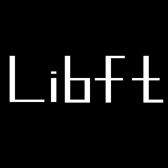

<p align="center">
  <a href="">
    
  </a>
</p>

# Table of Contents
- [Table of Contents](#table-of-contents)
- [0. Description](#0-description)
- [1. Libc functions](#1-libc-functions)
- [2. Additional functions](#2-additional-functions)
- [Testers](#testers)

# 0. Description

| Program name | libft.a |
|:--- |:---|
| Turn in files | *.c, libft.h, Makefile |
| Makefile  | Yes |
| External functs. | Detailed below |
| Libft authorized | Non-applicable |
| Description  | Write your own library, containing an extract of important functions for your cursus. |

> It is forbidden to declare global variables.
>
> If you need subfunctions to write a complex function, you should define these subfunctions as static to avoid publishing them with your library. It would be a good habit to do this in your future projects as well.
> 
> Submit all files in the root of your repository.
> 
> It is forbidden to submit unused files.
> 
> Every .c must compile with flags.
> 
> You must use the command ar to create your library, using the command libtool is forbidden.

# 1. Libc functions

- isalpha
    
    💡 `int isalpha(int c);`

    checks for an alphabetic character; in the standard "C" locale, it is equivalent to (isupper(c) || is‐lower(c)).  In some locales, there may be additional characters for which  isalpha()  is true-letters which are neither uppercase nor lowercase.
    
- isdigit
    
    💡 `int isdigit(int c);`

    checks for a digit (0 through 9).
    
- isalnum
    
    💡 `int isalnum(int c);`

    checks for an alphanumeric character; it is equivalent to (isalpha(c) || isdigit(c)).
    
- isascii
    
    💡 `int isascii(int c);`

    checks whether c is a 7-bit unsigned char value that fits into the ASCII character set.
    
- isprint
    
    💡 `int isprint(int c);`
    
    checks for any printable character including space.
    
- strlen
    
    💡 **NAME**
    strlen - calculate the length of a string

    **SYNOPSIS**
    ```C
    #include <string.h>
    size_t strlen(const char *s);
    ```

    **DESCRIPTION**
    The  strlen()  function  calculates  the length of the string pointed to by s, excluding the terminating null byte ('\0').

    **RETURN VALUE**
    The strlen() function returns the number of bytes in the string pointed to by s.
    
- memset
    
    💡 **NAME**
    memset — fill memory with a constant byte

    **SYNOPSIS**
    ```C
    #include <string.h>
    void *memset(void *s, int c, size_t n);
    ```

    **DESCRIPTION**
    The memset() function fills the first n bytes of the memory area pointed to by s with the constant byte c.

    **RETURN VALUE**
    The memset() function returns a pointer to the memory area s.
    
- bzero
    
    💡 **NAME**
    bzero, explicit_bzero — zero a byte string

    **SYNOPSIS**
    ```C
    #include <strings.h>
    void bzero(void *s, size_t n);
    ```

    **DESCRIPTION**
    The bzero() function erases the data in the n bytes of the memory starting at the location pointed to by s, by writing zeros (bytes containing '\0') to that area.
    
    **RETURN VALUE**
    None.
    
- memcpy
    
    💡 **NAME**
    memcpy — copy memory area

    **SYNOPSIS**
    ```C
    #include <string.h>
    void *memcpy(void *dest, const void *src, size_t n);
    ```

    **DESCRIPTION**
    The  memcpy()  function  copies  n  bytes from memory area src to memory area dest.  The memory areas ***must not overlap***.  Use memmove(3) if the memory areas do overlap.

    **RETURN VALUE**
    The memcpy() function returns a pointer to dest.
    
- memmove
    
    💡 **NAME**
    memmove — copy memory area

    **SYNOPSIS**
    ```C
    #include <string.h>
    void *memmove(void *dest, const void *src, size_t n);
    ```
    
    **DESCRIPTION**
    The memmove() function copies n bytes from memory area src to memory area dest.  The memory areas ***may overlap***: copying takes place as though the bytes in src are first copied into a temporary array that does  not  overlap src or dest, and the bytes are then copied from the temporary array to dest.
    
    **RETURN VALUE**
    The memmove() function returns a pointer to dest.
    
- strlcpy
    
    💡 **NAME**
    strlcpy — size-bounded string copying

    **SYNOPSIS**
    ```C
    #include <string.h>
    size_t strlcpy(char *dst, const char *src, size_t size);
    ```
    
    **DESCRIPTION**
    The strlcpy() function copies up to size - 1 characters from the NUL-terminated string src to dst, NUL-terminating the result.
    
    **RETURN VALUE**
    The strlcpy() function returns ***the length of src***.
    
- strlcat
    
    💡 **NAME**
    strlcat — size-bounded string concatenation

    **SYNOPSIS**
    ```C
    #include <string.h>
    size_t strlcat(char *dst, const char *src, size_t size);
    ```

    **DESCRIPTION**
    The strlcat() function appends the NUL-terminated string src to the end of dst.  It will append at most size - strlen(dst) - 1 bytes, NUL-terminating the result.
    
    **RETURN VALUE**
    The strlcat() function returns the ***initial length of dst plus the length of src***.  While this may seem somewhat confusing, it was done to make truncation detection simple.
    Note, however, that if strlcat() traverses size characters without finding a NUL, the length of the string is considered to be size and the destination string will not be NUL terminated (since there was no space for the NUL).  This keeps strlcat() from running off the end of a string.  In practice this should not happen (as it means that either size is incorrect or that dst is not a proper “C” string).  The check exists to prevent poten‐
    tial security problems in incorrect code.
    
    💡 The strlcpy() and strlcat() functions copy and concatenate strings respectively.  They are designed to be safer, more consistent, and less error prone replacements for strncpy(3) and strncat(3).  Unlike those functions, strlcpy() and strlcat() take the full size of the buffer (not just the length) and guarantee to NUL-terminate the result (as long as size is larger than 0 or, in the case of strlcat(), as long as there is at least one byte free in dst).  Note that a byte for the NUL should be included in size.  Also note that strlcpy() and strlcat() only operate on true “C” strings.  This means that for strlcpy() src must be NUL-terminated and for strlcat() both src and dst must be NUL-terminated.
    
- toupper
- tolower
    
    💡 **NAME**
    toupper, tolower - convert uppercase or lowercase

    **SYNOPSIS**
    ```C
    #include <ctype.h>
    int toupper(int c);
    int tolower(int c);
    ```
    
    **DESCRIPTION**
    These functions convert lowercase letters to uppercase, and vice versa.
    If  c is a lowercase letter, toupper() returns its uppercase equivalent, if an uppercase representation exists in the current locale.  Otherwise, it returns c.
    If  c is an uppercase letter, tolower() returns its lowercase equivalent, if a lowercase representation exists in the current locale.  Otherwise, it returns c.
    If c is neither an unsigned char value nor EOF, the behavior of these functions is undefined.
    
    **RETURN VALUE**
    The value returned is that of the converted letter, or c if the conversion was not possible.
    
- strchr
- strrchr
    
    💡 **NAME**
    strchr, strrchr- locate character in string

    **SYNOPSIS**
    ```C
    #include <string.h>
    char *strchr(const char *s, int c);
    char *strrchr(const char *s, int c);
    ```
    
    **DESCRIPTION**
    The strchr() function returns a pointer to the first occurrence of the character c in the string s.
    The strrchr() function returns a pointer to the last occurrence of the character c in the string s.
    Here "character" means "byte"; these functions do not work with wide or multibyte characters.
    
    **RETURN VALUE**
    The strchr() and strrchr() functions return a pointer to the matched character or NULL if the character is not found. The  terminating null byte is considered part of the string, so that if c is specified as '\0', these functions return a pointer to the terminator.
    
- strncmp
    
    💡 **NAME**
    strcmp, strncmp — compare two strings

    **SYNOPSIS**
    ```C
    #include <string.h>
    int strcmp(const char *s1, const char *s2);
    int strncmp(const char *s1, const char *s2, size_t n);
    ```
    
    **DESCRIPTION**
    The strcmp() function compares the two strings s1 and s2.  The locale is not taken into account (for a locale-aware comparison, see strcoll(3)).  It returns an integer less than, equal to, or greater than zero if  s1  is found, respectively, to be less than, to match, or be greater than s2.
    The strncmp() function is similar, except it compares only the first (at most) n bytes of s1 and s2.
    
    **RETURN VALUE**
    The strcmp() and strncmp() functions return an integer less than, equal to, or greater than zero if s1 (or the first n bytes thereof) is found, respectively, to be less than, to match, or be greater than s2.
    
- memchr
    
    💡 **NAME**
    memchr — scan memory for a character

    **SYNOPSIS**
    ```C
    #include <string.h>
    void *memchr(const void *s, int c, size_t n);
    ```
    
    **DESCRIPTION**
    The  memchr()  function scans the initial n bytes of the memory area pointed to by s for the first instance of c.  Both c and the bytes of the memory area pointed to by s are interpreted as unsigned char.
    
    **RETURN VALUE**
    The  memchr()  and memrchr() functions return a pointer to the matching byte or NULL if the character does not occur in the given memory area.
    
- memcmp
    
    💡 **NAME**
    memcmp — compare memory areas

    **SYNOPSIS**
    ```C
    #include <string.h>
    int memcmp(const void *s1, const void *s2, size_t n);
    ```

    **DESCRIPTION**
    The  memcmp()  function  compares the first n bytes (each interpreted as unsigned char) of the memory areas s1 and s2.

    **RETURN VALUE**
    The memcmp() function returns an integer less than, equal to, or greater than zero if the first n bytes of  s1 is found, respectively, to be less than, to match, or be greater than the first n bytes of s2.
    For a nonzero return value, the sign is determined by the sign of the difference between the first pair of bytes (interpreted as unsigned char) that differ in s1 and s2.
    If n is zero, the return value is zero.
    
- strnstr
    
    💡 **NAME**
    strnstr — locate a substring in a string

    **SYNOPSIS**
    ```C
    #include <string.h>
    char *strnstr(const char *big, const char *little, size_t len);
    ```
    
    **DESCRIPTION**
    The strnstr() function locates the first occurrence of the null-terminated string little in the string big,
    where not more than len characters are searched.  Characters that appear after a ‘\0’ character are not searched.  Since the strnstr() function is a FreeBSD specific API, it should only be used when portability is not a concern.
    
    **RETURN VALUES**
    If little is an empty string, big is returned; if little occurs nowhere in big, NULL is returned; otherwise a pointer to the first character of the first occurrence of little is returned.
    
- atoi
    
    💡 **NAME**
    atoi, atol, atoll — convert a string to an integer

    **SYNOPSIS**
    ```C
    #include <stdlib.h>
    int atoi(const char *nptr);
    long atol(const char *nptr);
    long long atoll(const char *nptr);
    ```
    
    **DESCRIPTION**
    The atoi() function converts the initial portion of the string pointed to by nptr to int.  The behavior is the same as strtol(nptr, NULL, 10); except that atoi() does not detect errors.
    The atol() and atoll() functions behave the same as atoi(), except that they convert the  initial  portion  of the string to their return type of long or long long.

    **RETURN VALUE**
    The converted value.
    
    💡 **NAME**
    strtol, strtoll, strtoq - convert a string to a long integer

    **SYNOPSIS**
    ```C
    #include <stdlib.h>
    long int strtol(const char *nptr, char **endptr, int base);
    long long int strtoll(const char *nptr, char **endptr, int base);
    ```
    
    **DESCRIPTION**
    The strtol() function converts the initial part of the string in nptr to a long integer value according to the given base, which must be between 2 and 36 inclusive, or be the special value 0. The string may begin with an arbitrary amount of white space (as determined by isspace(3)) followed by a  single  optional  '+' or '-' sign.  If base is zero or 16, the string may then include a "0x" or "0X" prefix, and the number will be read in base 16; otherwise, a zero base is taken as 10 (decimal) unless the next  character is '0', in which case it is taken as 8 (octal). The  remainder  of  the  string  is converted to a long int value in the obvious manner, stopping at the first character which is not a valid digit in the given base.  (In bases above 10, the letter 'A' in  either  uppercase or lowercase represents 10, 'B' represents 11, and so forth, with 'Z' representing 35.) If  endptr  is not NULL, strtol() stores the address of the first invalid character in *endptr.  If there were no digits at all, strtol() stores the original value of nptr in *endptr (and returns 0). In particular, if *nptr is not '\\0' but **endptr is '\\0' on return, the entire string is valid.
    The strtoll() function works just like the strtol() function but returns a long long integer value.

    **RETURN VALUE**
    The  strtol() function returns the result of the conversion, unless the value would underflow or overflow. If an underflow occurs, strtol() returns LONG_MIN.  If an overflow occurs, strtol() returns  LONG_MAX. In both cases,  errno  is set to ERANGE.  Precisely the same holds for strtoll() (with LLONG_MIN and LLONG_MAX instead of LONG_MIN and LONG_MAX).
    
- calloc
    
    💡 **NAME**
    malloc, free, calloc, realloc — allocate and free dynamic memory

    **SYNOPSIS**
    ```C
    #include <stdlib.h>
    void *malloc(size_t size);
    void free(void *ptr);
    void *calloc(size_t nmemb, size_t size);
    ```
    
    **DESCRIPTION**
    The calloc() function allocates memory for an array of nmemb elements of size bytes each and returns a pointer to the allocated memory.  The memory is set to zero.  If nmemb or size is  0,  then  calloc()  returns  either NULL,  or  a  unique  pointer value that can later be successfully passed to free().  If the multiplication of nmemb and size would result in integer overflow, then calloc() returns an  error.   By  contrast,  an  integer overflow  would  not  be detected in the following call to malloc(), with the result that an incorrectly sized block of memory would be allocated: malloc(nmemb * size);
    
    **RETURN VALUE**
    The malloc() and calloc() functions return a pointer to the allocated memory, which is  suitably  aligned  for any built-in type.  On error, these functions return NULL. NULL may also be returned by a successful call to malloc() with a size of zero, or by a successful call to calloc() with nmemb or size equal to zero.
    
- strdup
    
    💡 **NAME**
    strdup, strndup, strdupa, strndupa — duplicate a string

    **SYNOPSIS**
    ```C
    #include <string.h>
    char *strdup(const char *s);
    ```
    
    **DESCRIPTION**
    The  strdup() function returns a pointer to a new string which is a duplicate of the string s.  Memory for the new string is obtained with malloc(3), and can be freed with free(3).

    **RETURN VALUE**
    On success, the strdup() function returns a pointer to the duplicated string.  It returns NULL if insufficient memory was available, with errno set to indicate the cause of the error.
    
# 2. Additional functions

# Testers

[GitHub - ska42/libft-war-machine: forked repository of libftest (by jtoty) for libft at 42](https://github.com/ska42/libft-war-machine)

[GitHub - Tripouille/libftTester: Tester for the libft project of 42 school](https://github.com/Tripouille/libftTester)

[GitHub - alelievr/libft-unit-test](https://github.com/alelievr/libft-unit-test)

[GitHub - jtoty/Libftest](https://github.com/jtoty/Libftest)